# LearningLab - E-Learning Web Application

## 📝 Project Overview
**LearningLab** is a comprehensive e-learning web application developed using **Java Spring Boot** for the backend and **jQuery**, **HTML**, and **CSS** for the frontend. This project, created by **Lahiru Kodikara**, demonstrates advanced web development skills, focusing on scalability, user-friendly design, and robust functionality for online education.

---

## 🚀 Key Features

### **Core Functionalities**
- **User Authentication**: Secure login and signup with role-based access (Admin/Instructor/Student).
- **Role Management**: Admins and Instructors have distinct capabilities tailored to their roles.

### **Admin Capabilities**
- **User Management**: View, search, filter, and manage user accounts.
- **Course Management**: Add, edit, delete, and view courses with advanced search and statistics.
- **Enrollment Management**: Track, filter, and analyze course enrollments with detailed statistics.
- **Category Management**: Manage course categories (add, edit, delete, and view).
- **Schedule Management**: Add, update, and delete events and publish to other users.

### **Instructor Functionalities**
- **Course Browsing**: Search, filter, and view courses with a user-friendly interface.
- **Enrollment**: Enroll in courses and manage enrollments.
- **Progress Tracking**: View course progress and completed lessons.
- **Profile Management**: Update instructor profile information, username, and password.

---

## 🛠 Technical Stack
- **Backend**: Java Spring Boot
- **Database**: MySQL
- **Connection Pooling**: Tomcat JDBC connection pooling
- **Frontend**: jQuery, HTML, CSS
- **Optional Enhancements**: Bootstrap for responsive UI, jQuery for dynamic interactions, and some APIs.

---

## 📦 Database Schema
The database is designed to support all application functionalities. Key tables include:
- `courses`: Stores course details.
- `lessons`: Manages lessons and videos.
- `users`: Handles user information and roles.
- `enrollments`: Tracks students' course enrollments.
- `progress`: Stores students' progress in courses.
- `lessons`: Manages individual lessons within courses.

---

## 🔧 Setup Instructions

### **Prerequisites**
- Java Development Kit (JDK) 17+
- Apache Tomcat 10.1.x
- MySQL Database

### **Installation Steps**
1. Clone the repository:
   ```bash
   git clone https://github.com/LahiruChanak/LearningLab_E-Learning-platform.git
   ```
2. Navigate to the project directory:
   ```bash
   cd LearningLab
   ```
3. Import the project into your IDE and reload the `pom.xml` file.
4. Configure the database connection in `src/main/webapp/META-INF/context.xml`.
5. Deploy the application on the Tomcat server.
6. Run the application and access it via your browser.

---

## 🖼 Application Screenshots

### **Authentication Pages**
| **Login Page** | **Signup Page**                                             | **Reset Password Page**                                             |
|----------------|-------------------------------------------------------------|---------------------------------------------------------------------|
| 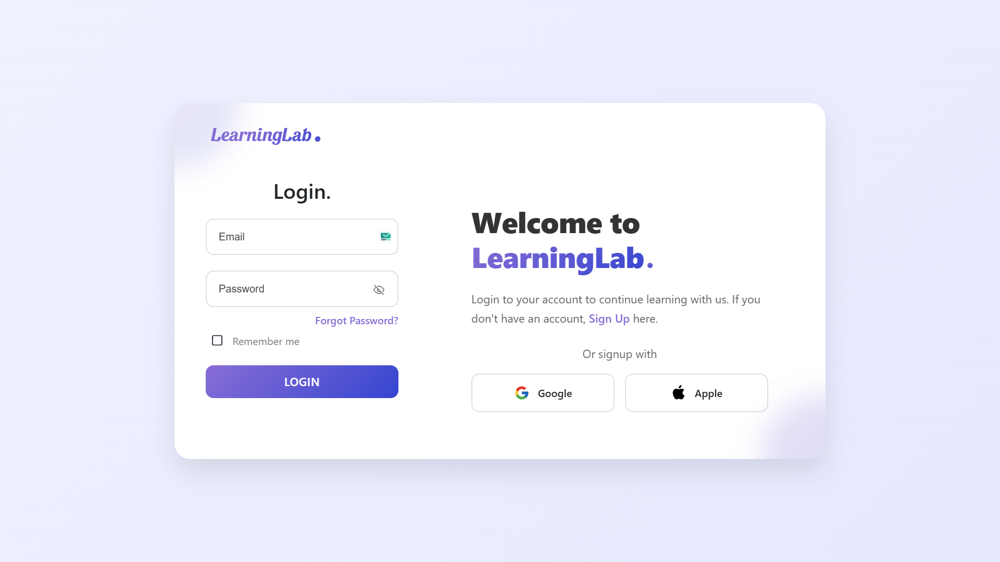 | 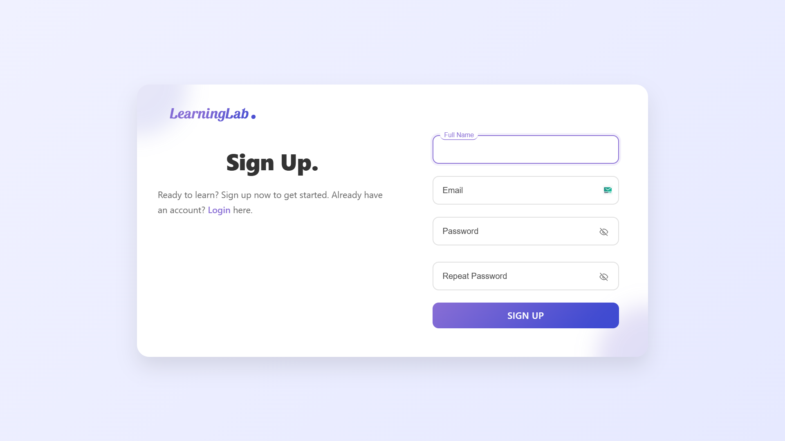 | 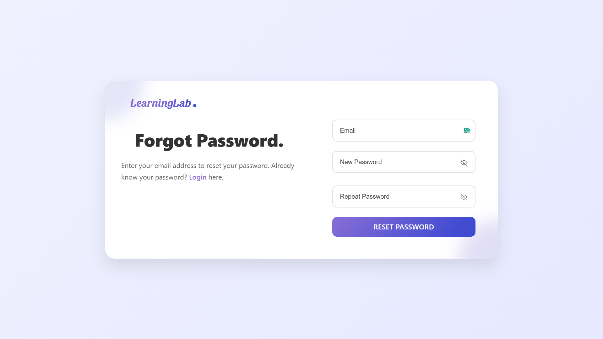 |

### **Student Pages**
| **Student Homepage**                                             | **Student Profile**                                             | **Course Search Page**                                             | **Enrollment Page**                                             |
|------------------------------------------------------------------|-----------------------------------------------------------------|--------------------------------------------------------------------|-----------------------------------------------------------------|
| 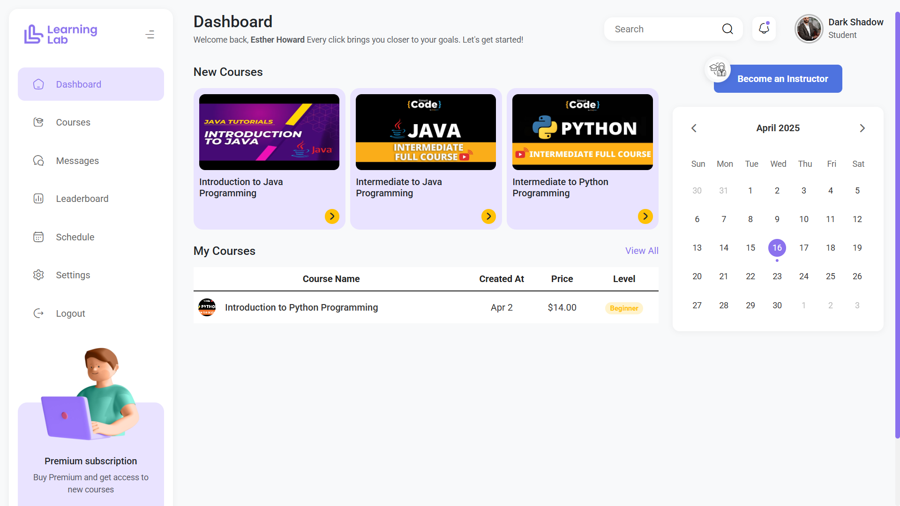 | 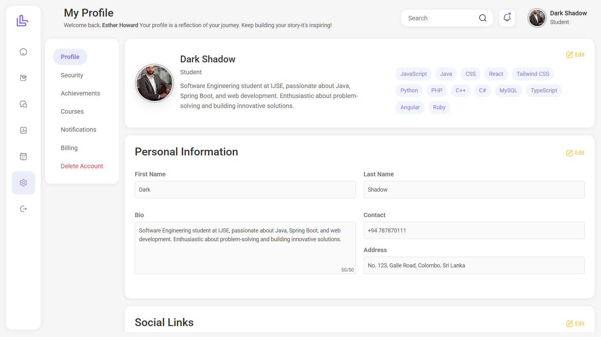 | 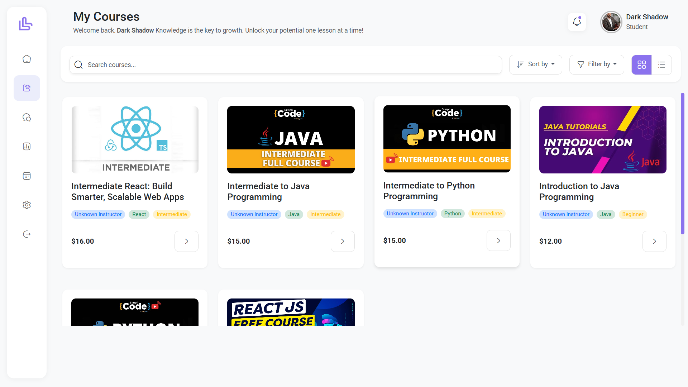 | 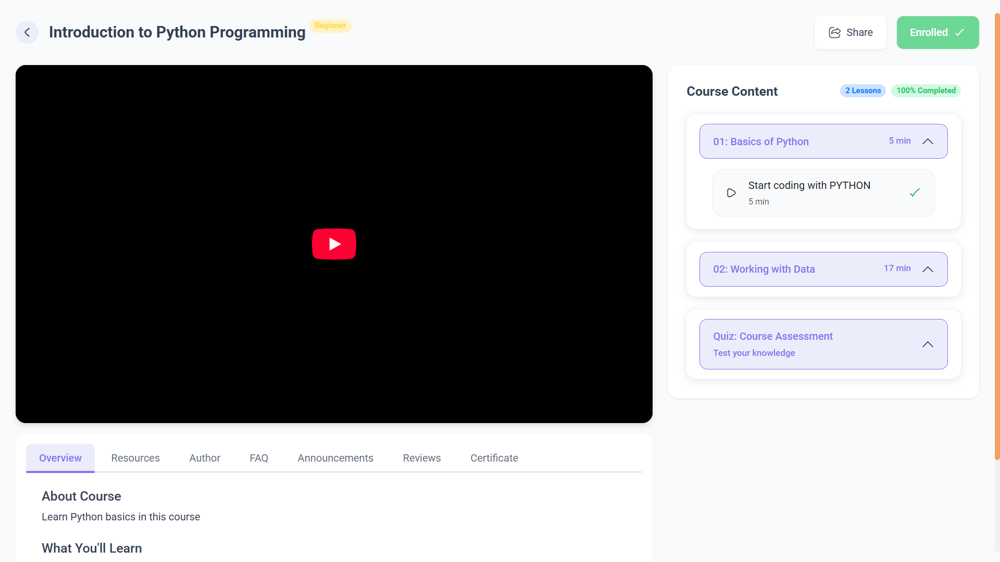 |

### **Admin Pages**
| **Lesson Management**                                             | **Course Management**                                             | **User Management**                                             | **Category Management**                                             | **Instructor Requests Management**                                             | **Schedule Management**                                                        |
|-------------------------------------------------------------------|-------------------------------------------------------------------|-----------------------------------------------------------------|---------------------------------------------------------------------|--------------------------------------------------------------------------------|--------------------------------------------------------------------------------|
| 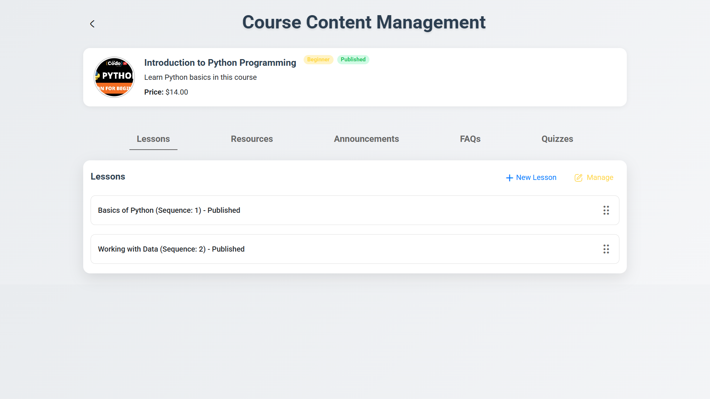 | 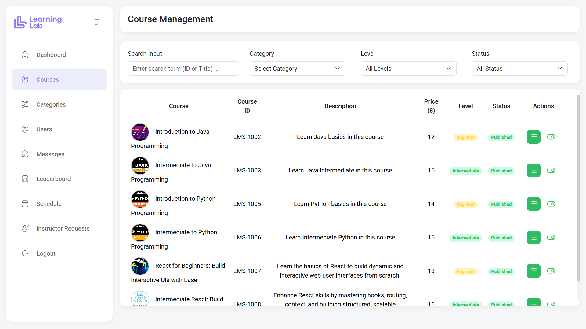 | 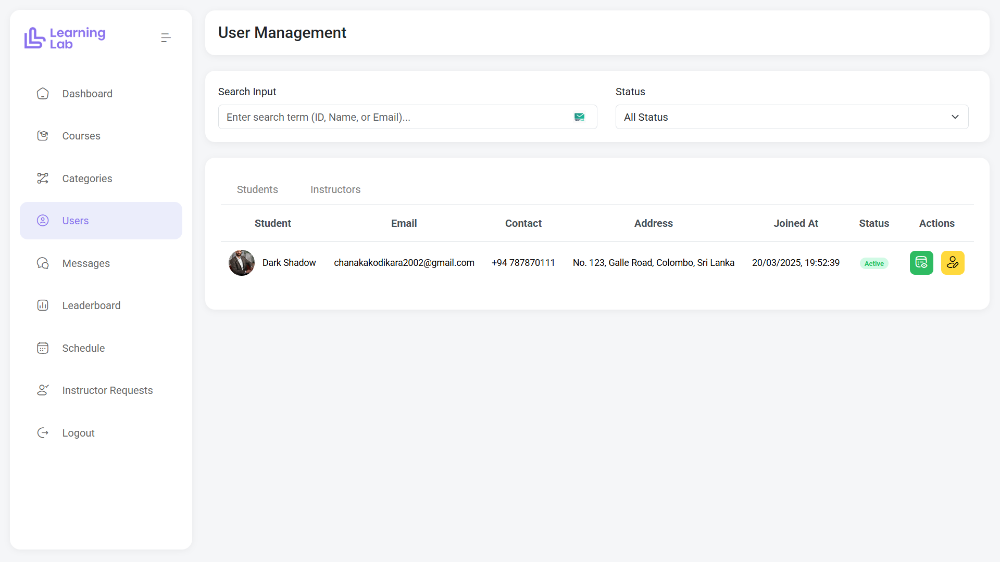 | 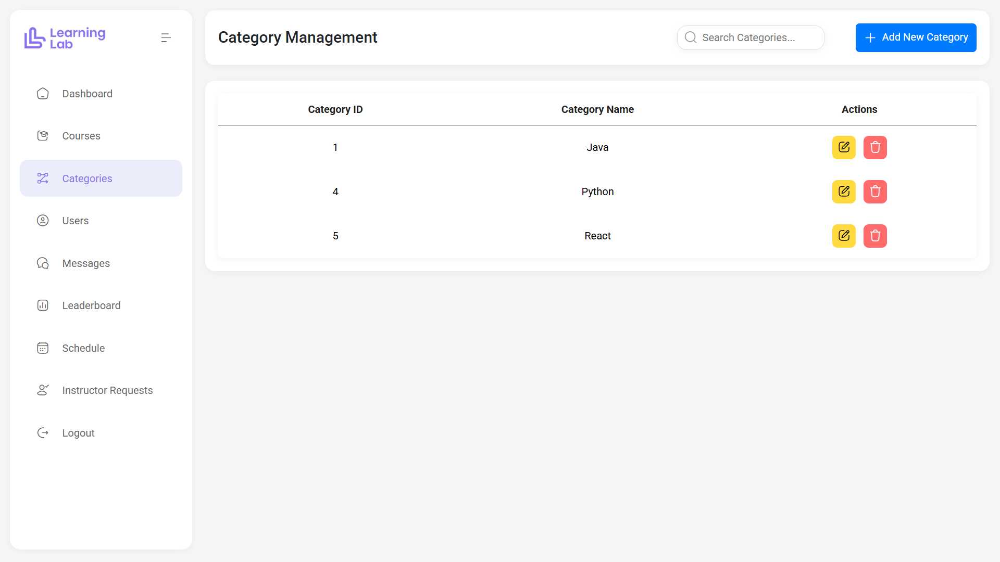 | 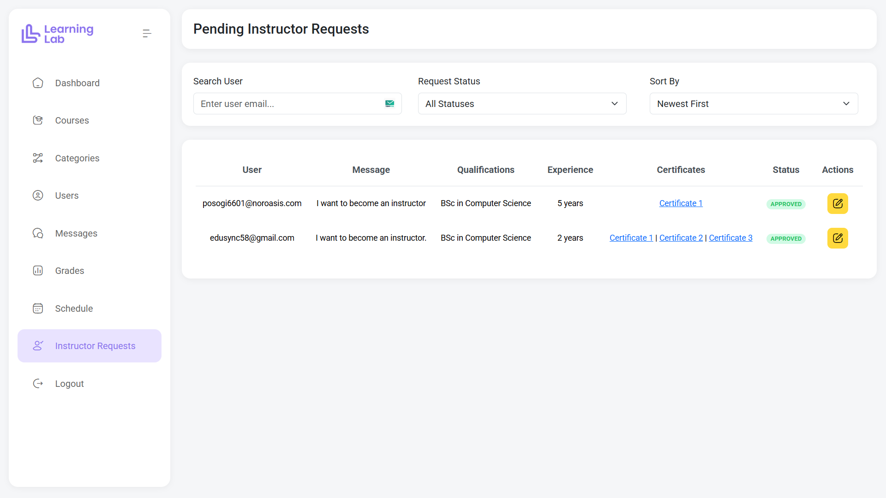 | 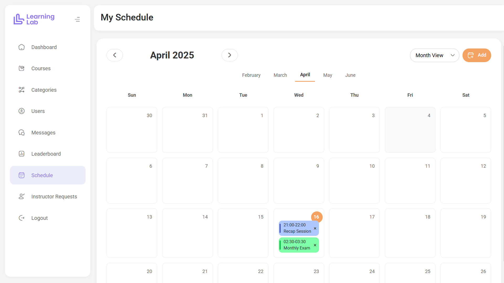 |

---

## 🎥 Demo Video
A demo video showcasing the application's features is available on YouTube:  
[YouTube Demo Link](https://youtu.be/ceAtm13N7m4)

---

## 🌟 Bonus Features
- **Advanced Course Search**: Filter courses by subject, difficulty, and ratings.
- **User Progress Tracking**: Monitor learner progress and completion status.
- **Interactive Quizzes**: Engage learners with quizzes and assessments.

---

## 👥 Contributors
- **Lahiru Kodikara** - Project Developer  
  [GitHub Profile](https://github.com/LahiruChanak)

---

**Project URL**: [https://github.com/LahiruChanak/LearningLab_E-Learning-platform](https://github.com/LahiruChanak/LearningLab_E-Learning-platform)  
**Branch**: `master`
